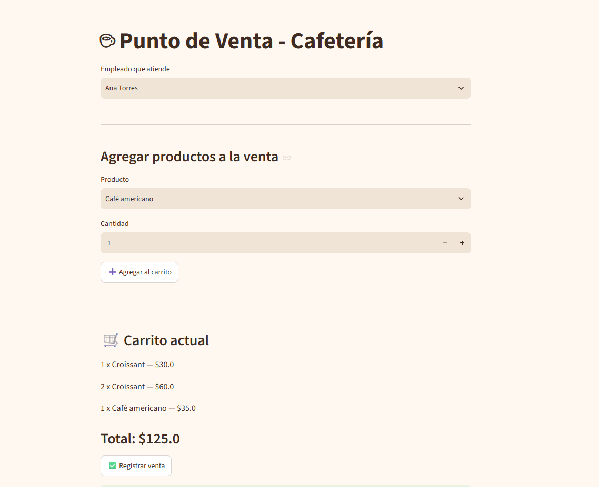

# ☕ Cafetería POS — Punto de Venta


Sistema de punto de venta (POS) para una cafetería, construido como proyecto de aprendizaje de desarrollo de software. Permite registrar ventas, descontar inventario automáticamente y llevar un historial de movimientos, todo con una interfaz web sencilla.

## Demo en vivo

 [Ver la app desplegada](#) <!-- Reemplazar con la URL de Streamlit Cloud una vez desplegada -->

## Utilidad

Este proyecto nace como ejercicio práctico para aprender a construir un sistema de gestión completo, de principio a fin: diseño de base de datos relacional, lógica de negocio en backend, e interfaz de usuario — inspirado en necesidades reales de pequeños negocios que llevan su operación de forma desorganizada (Excel, capturas de pantalla, facturas sueltas).

## Stack tecnológico

| Capa | Tecnología |
|---|---|
| Base de datos | Supabase (PostgreSQL) |
| Backend / lógica | Python |
| Interfaz | Streamlit |
| Control de versiones | Git + GitHub |

## Estructura de la base de datos

```
empleados
├── id, nombre, rol, fecha_registro

productos
├── id, nombre, categoria, precio, stock_actual, stock_minimo

ventas
├── id, fecha, empleado_id → empleados, total

detalle_venta
├── id, venta_id → ventas, producto_id → productos, cantidad, precio_unitario, subtotal

inventario_movimientos
├── id, producto_id → productos, tipo, cantidad, fecha, motivo
```

## Funcionalidades

- Selección de empleado que atiende la venta
- Carrito de compra con múltiples productos
- Cálculo automático de subtotales y total
- Registro de venta con actualización automática de:
  - Detalle de la venta
  - Stock de productos
  - Historial de movimientos de inventario


##  Vista previa



## Instalación y uso local

1. Clona el repositorio
   ```bash
   git clone https://github.com/Alice-kr39/Portafolio.git
   cd Portafolio/cafeteria-pos
   ```

2. Crea y activa un entorno virtual
   ```bash
   python -m venv venv
   venv\Scripts\Activate.ps1   # Windows PowerShell
   ```

3. Instala las dependencias
   ```bash
   pip install -r requirements.txt
   ```

4. Configura tus variables de entorno
   Crea un archivo `.env` en la raíz con:
   ```
   SUPABASE_URL=tu-url-de-supabase
   SUPABASE_KEY=tu-api-key-anon
   ```

5. Ejecuta la app
   ```bash
   streamlit run app.py
   ```

##  Roadmap

- [x] Diseño de base de datos relacional
- [x] Lógica de registro de ventas con actualización de inventario
- [x] Interfaz web con Streamlit
- [ ] Alertas de stock bajo
- [ ] Reportes y dashboards con Power BI
- [ ] Autenticación de usuarios

## Autora

** proyecto de aprendizaje en desarrollo de software.
[GitHub](https://github.com/Alice-kr39)
